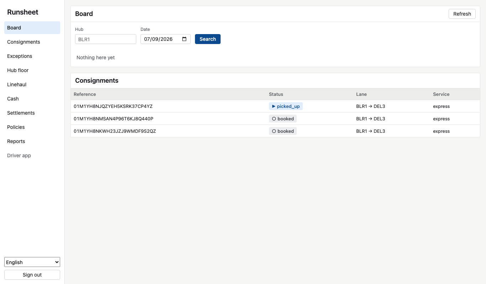

# Runsheet

Runsheet is an execution platform for logistics networks. It plans the day's work, runs it in
the field, closes the money, and can prove every automated decision it made.

## The problem it solves

A courier, postal operator, or distributor moving fifty thousand to two million shipments a
month runs on a patchwork: a system of record, spreadsheets for rates and settlement, a
messaging app for exceptions, a routing tool bolted on the side. Three things go wrong every day
in that gap, and each one costs margin:

1. **Deliveries fail or run late** because the address was a landmark, the stops were badly
   sequenced, or the parcel sat in a hub nobody was watching.
2. **Money leaks** in carrier invoices nobody has time to check, cash on delivery that does not
   quite add up at the end of the driver's day, and disputes that are never fought.
3. **Exceptions are handled at human speed**, so most of them breach the service level before
   anyone has even seen them.

Enterprise platforms solve this for the largest operators, behind a services engagement and a
closed interface. Smaller tools solve dispatch and stop there. Runsheet is built for the
operators in between, and it is open source and self-hostable all the way down.

What that means in practice:

| The operator's problem                                             | What Runsheet does about it                                                                                                                          |
| ------------------------------------------------------------------ | ---------------------------------------------------------------------------------------------------------------------------------------------------- |
| A parcel is booked with an address like "near the metro, flat 402" | Parses landmarks and units the way people write them, and raises the confidence every time a driver confirms the pin at the door                     |
| A hub floor with thousands of parcels and a handful of scanners    | Scan in, scan out to a run, re-weigh; an unexpected parcel is flagged rather than refused, a misread barcode is caught by its check digit            |
| Freight between cities in sealed bags on trucks                    | Bags, seals, trips, and a manifest the far end checks without opening anything; a bag at the wrong hub is recorded, not turned away                  |
| A driver with a cracked phone and no signal                        | An app that never waits for the network, and one call that takes a whole shift's work, recorded exactly once however many times it is retried        |
| Cash collected at the door                                         | A ledger where a driver's shortfall stays owed until a supervisor approves the write-off, and the merchant's payable is always right                 |
| A carrier invoice with a thousand lines                            | Every line matched four ways: what was ordered, what the rate card says, what actually happened, what was billed. Lines that agree settle themselves |
| Automation nobody trusts                                           | Every policy runs dry, then in shadow against people, then to a percentage, then live. Every decision is recorded so it can be replayed              |
| "How did we do?"                                                   | Six operational reports as data or as a file, and a baseline comparison that refuses to call noise an improvement                                    |

## See it run


The recording is `infra/local/demo.sh` running against the local stack; every call in it is a
real request. A higher-quality copy is at [`docs/demo.mp4`](docs/demo.mp4). Regenerate it with
`make video`.

## The console



A web console for the office and an installable driver app for the handset, both on the published
interface, in English, Hindi, and Arabic. See [the console](docs/console.md).

## Run it

You need Docker, Node 24 or later, and pnpm.

```sh
git clone https://github.com/indranandjha1993/runsheet.git
cd runsheet
make setup      # copies .env.example, installs, starts infrastructure, migrates
make sandbox    # starts every service and prints a tenant and a key to call it with
```

Then follow a parcel through the whole platform, checking every step:

```sh
bash infra/local/walkthrough.sh
```

The defaults in `.env.example` work as they are, so a fresh clone runs without editing anything.
Ports are deliberately unusual, in the 13000 to 19999 range, so the stack does not collide with
whatever else you have running.

## Documentation

Everything needed to clone this, run it for a real operation, and understand it in detail is in
[`docs/`](docs/README.md):

- [Getting started](docs/getting-started.md), from clone to first delivery
- [Concepts](docs/concepts.md): consignment, run, hub, bag, trip, rate card, settlement, policy
- [Business flows](docs/flows.md): booking to settlement, step by step
- [The services](docs/services.md), one per bounded context, with every route
- [The interface](docs/api.md): authentication, tenancy, scopes, errors, the specifications
- [Events](docs/events.md), every event the platform publishes and what it means
- [Operations](docs/operations.md): configuration, deployment, migrations, health, logs
- [The driver app](docs/driver-app.md), [connectors](docs/connectors.md), [reporting](docs/reporting.md)
- [Questions people ask](docs/faq.md)

## The interface

Two specifications ship with the repository and are generated from the same schemas the services
validate against, so neither can describe something the code would reject:

| File                    | What it describes                                     |
| ----------------------- | ----------------------------------------------------- |
| `spec/openapi.json`     | Every HTTP route, its request body, and its responses |
| `contracts/events.json` | Every event, its payload, and the topic it goes on    |

A test fails if either falls behind the code, another fails if a service registers a route the
specification does not describe, and a third fails if the gateway cannot reach a published route.

Authentication is a bearer API key. The tenant comes from the key and never from a header, so a
credential cannot be pointed at somebody else's data.

## Principles

- Act, do not watch. Dashboards are not the product; closed loops are.
- Every automated decision can be replayed, simulated before rollout, and rolled back.
- Live in days. Setup and integration time is treated as a defect.
- Open all the way down: the whole execution layer is inspectable and self-hostable.
- Built for the field: offline-first, low bandwidth, imperfect addresses, cash on delivery.

## Layout

| Path                  | What is in it                                                         |
| --------------------- | --------------------------------------------------------------------- |
| `services/*`          | Twelve services, one per bounded context, each hexagonal inside       |
| `apps/web`            | The console and the driver app, React on the design tokens            |
| `apps/driver`         | The handset logic: offline queue, runsheet, three languages           |
| `packages/kernel`     | Event envelope, identifiers, money, barcodes                          |
| `packages/eventstore` | Append-only event stream, transactional outbox, idempotent consumer   |
| `packages/runtime`    | Configuration, logging, tracing, health, migrations                   |
| `packages/auth`       | Callers, scopes, and reads on a tenant's behalf                       |
| `packages/connector`  | The contract a carrier integration implements, and its runner         |
| `packages/webhooks`   | Signed, replayable deliveries                                         |
| `contracts`           | Event schemas and topic routing, the source of truth between services |
| `api`, `spec`         | How a service describes its routes, and the published specification   |
| `infra/local`         | The local stack, the sandbox, the walkthrough, and the demo           |
| `docs`                | The documentation                                                     |

## Contributing

See [`CONTRIBUTING.md`](CONTRIBUTING.md). Contributions are taken under the Developer
Certificate of Origin. Security reports go through [`SECURITY.md`](SECURITY.md).

## Licence

GNU Affero General Public License v3.0. See `LICENSE`.
