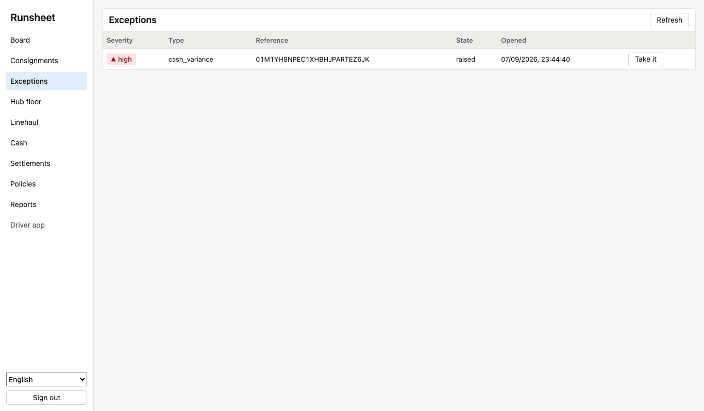

# The console and the driver app

One web application, `apps/web`, serves both the office and the handset. It is React with Vite
and TypeScript, built on the design tokens, and it speaks only to the platform's published
interface: nothing in it reaches a database or knows a service by name.

## The console

Sign in by pasting a key. The tenant comes from the key, as everywhere else. Nine screens, in
the order a dispatcher's day goes:

| Screen       | What it is for                                                            |
| ------------ | ------------------------------------------------------------------------- |
| Board        | The runs open at a hub today and every consignment still moving           |
| Consignments | One parcel's status, lane, weight, delivery time, and every hub scan      |
| Exceptions   | The queue of what a person must deal with, worst first                    |
| Hub floor    | Scan in with a re-weigh, scan out to a run; a refusal comes straight back |
| Linehaul     | The bags waiting at a hub and the trips on the road                       |
| Cash         | A driver's statement and closing their day against what they handed in    |
| Settlements  | Invoice lines by state; approve or dispute from the row                   |
| Policies     | Every automation and where it is in its rollout                           |
| Reports      | Run a report over a range, see it, download it as a file                  |

Rows are dense on purpose: thirty-two pixels, so a laptop shows a full screen of work without
scrolling. Nothing moves that the user did not move. Status is always ink, tint, and a mark
together, so a colour-blind dispatcher and a sun-washed screen both read it. Every identifier is
wrapped so it never scrambles inside right-to-left text.

## The driver app

`/driver` is the handset surface, installable as a web app. Controls are fifty-six pixels, the
primary action sixty-four and full width where a thumb reaches. Enter a run and the day is
downloaded once; from then on nothing waits for the network. Each tap goes to a queue kept in the
browser, and Send now pushes the shift in one call. What the office already had comes back as
duplicate; anything the reply did not settle stays queued.

## Languages

English, Hindi, and Arabic, switchable from either surface, remembered across reloads. Arabic
lays the whole page out right to left. A fourth pseudo locale grows every string by a third so a
layout that only fits English is caught in development.

## Running it

`make sandbox` starts it with the platform on `http://localhost:14100` and prints a key to sign
in with. In development, `pnpm --filter @runsheet/web dev` runs Vite with calls proxied to the
gateway. For a deployment, `pnpm --filter @runsheet/web build` produces static files;
`apps/web/serve.js` serves them and forwards platform calls to the gateway, or any static host
with a proxy rule for `/v1`, `/track`, and `/health` will do.

## What is not there yet

A dispatch board that drags stops between runs, live updates arriving as a "new" pill, keyboard
shortcuts, and the finance controller's resizable, persisted table layouts. The tokens and
components are in place for all of them.
