# The console, screen by screen

Open the console at your installation's address (locally `http://localhost:14100`), paste your
key, and sign in. The tenant comes from the key; there is nothing else to choose. The language
selector at the bottom of the navigation switches between English, Hindi, and Arabic, and Arabic
turns the whole layout right to left.

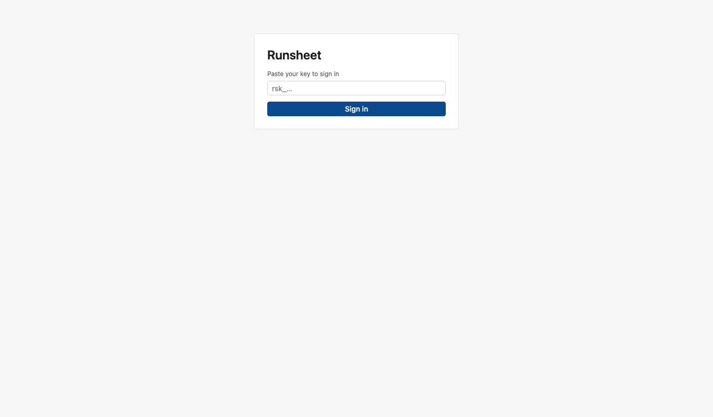

## Board

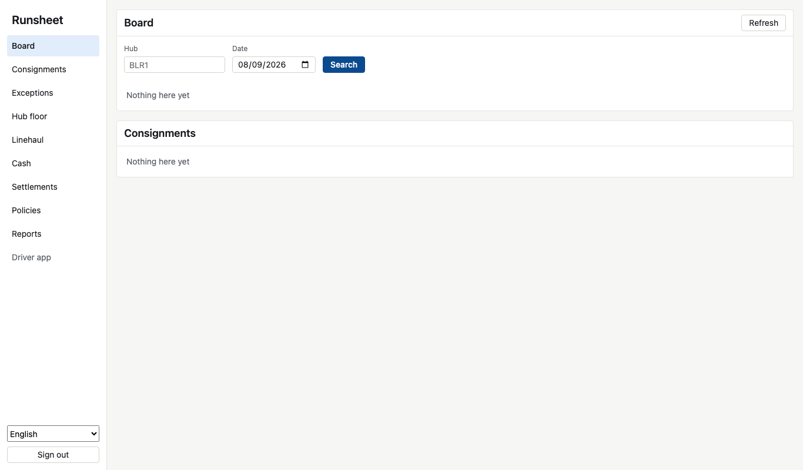

The day at a glance. Name a hub and a day and search to see the runs open there with their
status, driver, and stop count. Below it, every consignment still moving, most recently changed
first, with its lane and service. Refresh pulls in whatever changed; nothing moves on the screen
until you ask.

## Consignments

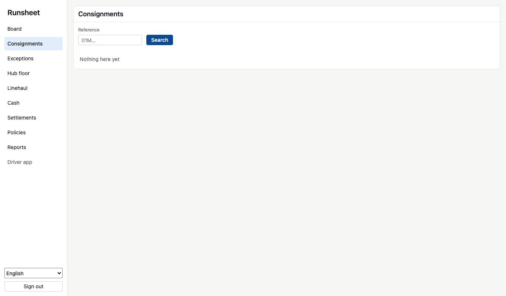

Paste a consignment identifier to see its status, lane, service and payment mode, total weight,
and when it was delivered. Under that, every hub scan it has had, in order, with whether each
was accepted and what it weighed. A scan that raised an exception shows it in the status.

## Exceptions

The queue of what a person must deal with, worst first: severity by ink, tint, and mark; the
type; the subject; the state; when it opened. Take it moves an exception to triaged so the next
person sees somebody has it. The same problem on the same subject appears once, however often
the network reports it.

## Hub floor

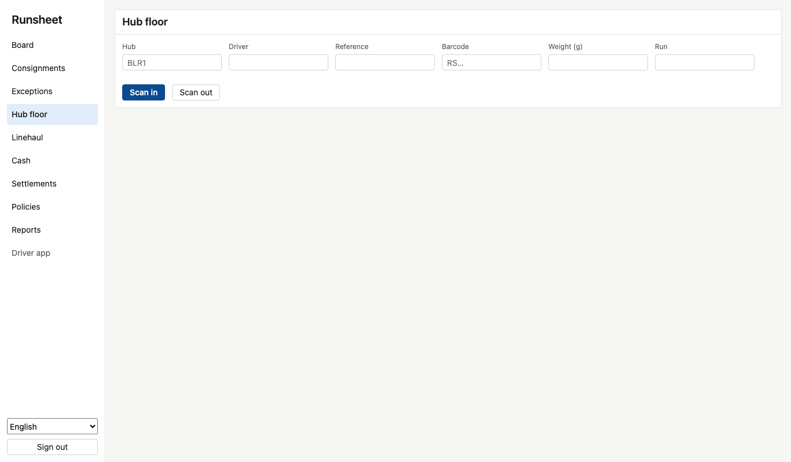

The scanning screen. Fill the hub and worker once; then for each parcel, the consignment, the
barcode, and optionally the weight from the scale, and Scan in. The platform's answer comes
straight back: scanned, or the exception it raised (a weight that differs from the booking), or
a refusal (a barcode whose check digit does not add up). Scan out needs the run the parcel is
leaving on, and refuses a parcel that is not on it.

## Linehaul

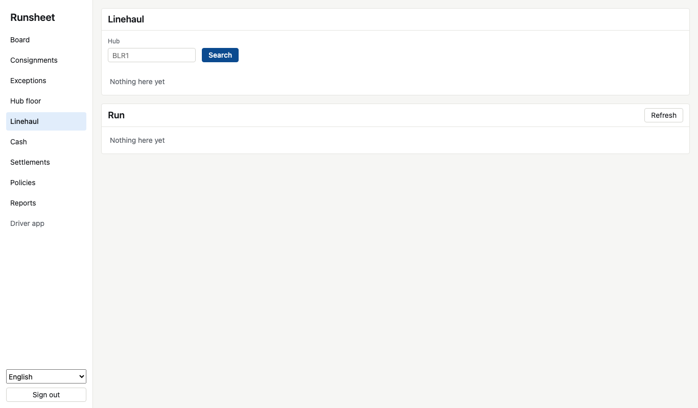

Name a hub to see the bags waiting there, open or sealed, with their seal numbers and parcel
counts. Below, every trip that has not closed, with its lane, date, driver, and how many bags
it carries. Sealing, loading, departing and receiving are done through the interface today; the
screens show where everything is.

## Cash

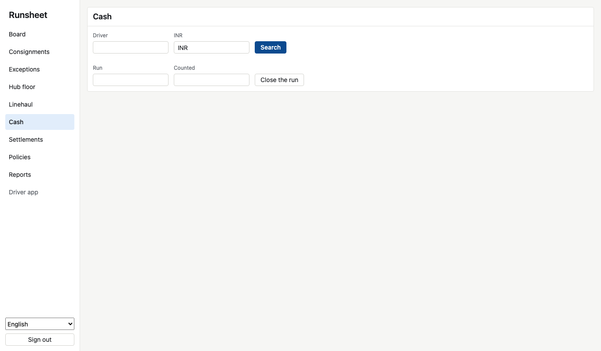

Name a driver and a currency to see what they are holding and every entry behind it. To close a
driver's day, enter the run and the amount they handed in: the variance is shown at once. A
shortfall stays on the driver; a write-off needs an approver and is done through the interface.

## Settlements

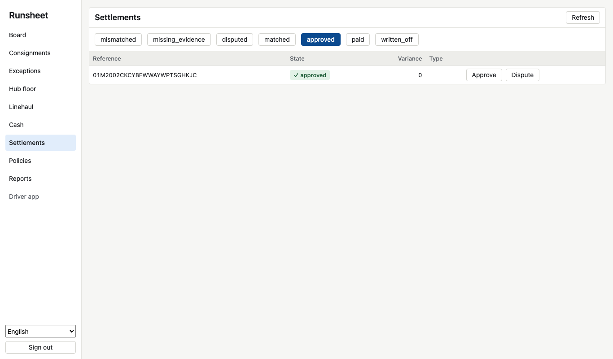

Carrier invoice lines by state. Start on mismatched: each row shows the variance against the
rate card and the reasons. Approve accepts the line as billed; Dispute opens it for the carrier.
Lines that matched within tolerance were approved automatically and are under approved.

## Policies

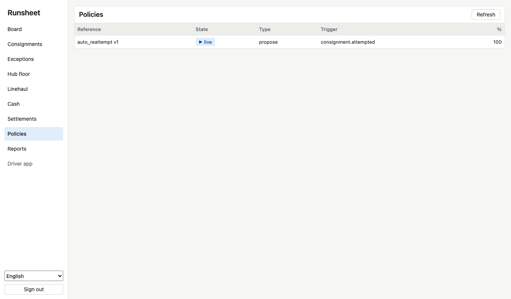

Every automation, its version, autonomy level, the event that triggers it, where it is in its
rollout, and what share of subjects it currently applies to. Moving a policy along its rollout
is done through the interface; the screen is where you check nothing went live that should not.

## Reports

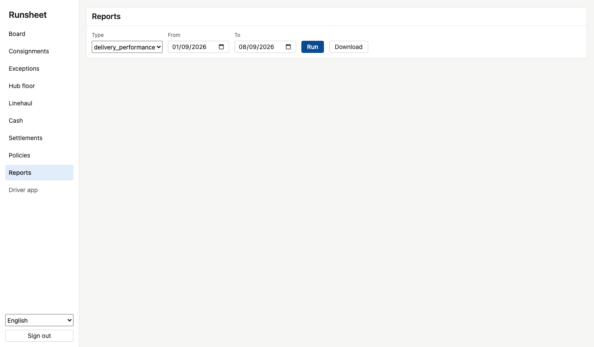

Choose a report and a date range and run it to see the rows, or download the same range as a
file that opens safely in a spreadsheet. The six reports are described in
[Reporting](reporting.md).

## The driver app

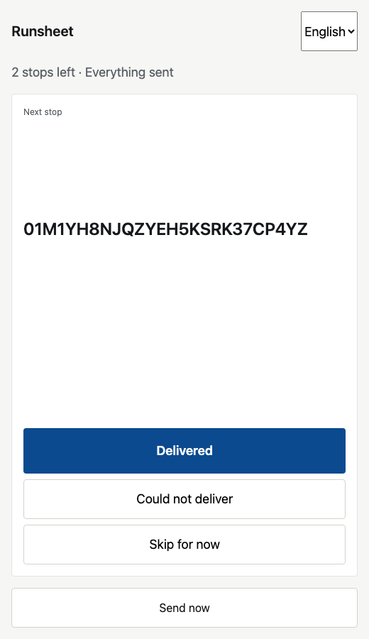{ width="32%" }
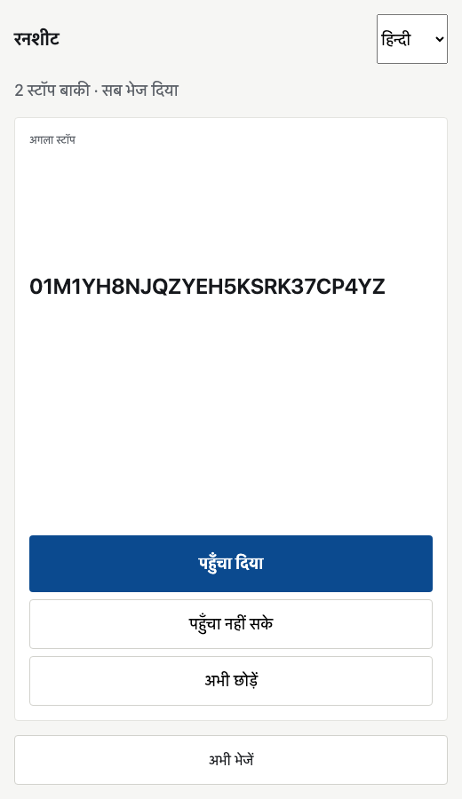{ width="32%" }
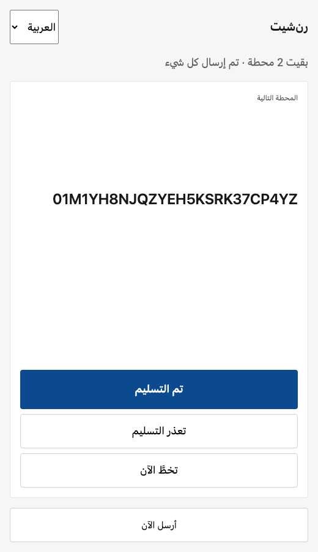{ width="32%" }

Open `/driver` on a handset, or hand a driver a link that carries their run. The next stop fills
the screen with one large action; done, could not deliver, or skip for now. Every tap is kept on
the handset and Send now pushes the shift in one call when there is signal. What the office
already had comes back as duplicate; nothing is ever sent twice or lost. [The driver app](driver-app.md)
explains what happens underneath.
